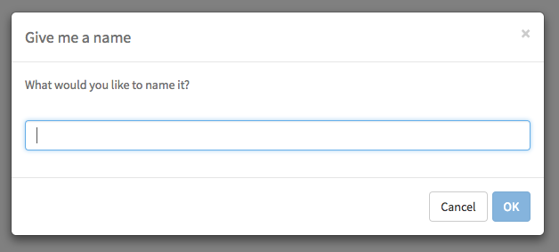
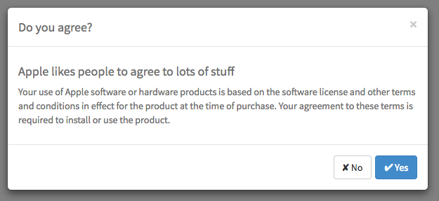
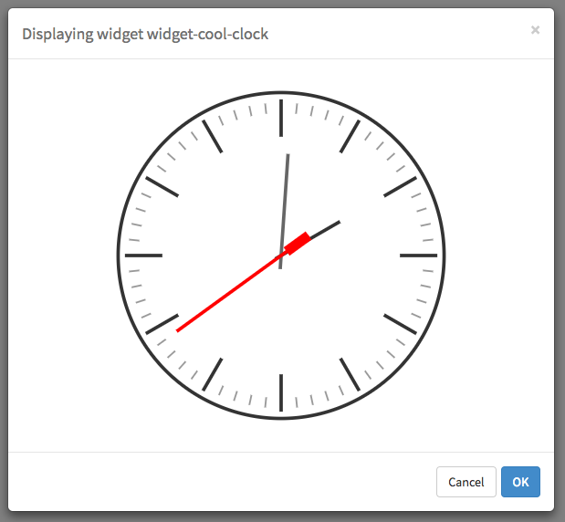

Open a modal with a customized set of options. See the options table below.

Open
------

### Example 1: Prompt with label



**Html Template**
```html
  <button ng-click="c.onOpen()" class="btn btn-default">
    Prompt with label
  </button>
  <div ng-show="c.name">
    You answered <span>{{c.name}}</span>
  </div>
```

**Client Script**
```javascript
function(spModal) {
  var c = this;
  c.onOpen = function() {
		//ask the user for a string
		spModal.open({
			title: 'Give me a name',
			message: 'What would you like to name it?',
			input: true,
			value: c.name
		}).then(function(name) {
			c.name = name;
		})
	}
}
```


<br /> <br />

### Example 2: Agree with custom buttons



**Html Template**
```html
  <button ng-click="c.onAgree()" class="btn btn-default">
    Agree
  </button>
  <div ng-show="c.agree">
    You answered {{c.agree}}
  </div>
```

**Client Script**
```javascript
function(spModal) {
  var c = this;
  c.onAgree = function() {
		// ask the user for a string
		// note embedded html in message
		var h = '<h4>Apple likes people to agree to lots of stuff</h4>'
		var m = 'Your use of Apple software or hardware products is based on the software license and other terms and conditions in effect for the product at the time of purchase. Your agreement to these terms is required to install or use the product. '
		spModal.open({
			title: 'Do you agree?',
			message: h + m,
			buttons: [
				{label:'✘ ${No}', cancel: true},
				{label:'✔ ${Yes}', primary: true}
			]
		}).then(function() {
			c.agree = 'yes';
		}, function() {
			c.agree = 'no';
		})
	}
}
```


<br /> <br />

### Example 3: Embedded widget 



**Html Template**
```html
  <button ng-click="c.onWidget('widget-cool-clock')" class="btn btn-default">
    Cool Clock
  </button>
```

**Client Script**
```javascript
function(spModal) {
  var c = this;
  c.onWidget = function(widgetId, widgetInput) {
		spModal.open({
			title: 'Displaying widget ' + widgetId,
			widget: widgetId, 
			widgetInput: widgetInput || {}
		}).then(function(){
			console.log('widget dismissed');
		})		
	}
}
```

<br /> <br />

### Example 4: Modal sizes 


**Html Template**
```html
  <button ng-click="c.onSize('sm')" class="btn btn-default">
    Small
  </button>
  <button ng-click="c.onSize()" class="btn btn-default">
    Default
  </button>
  <button ng-click="c.onSize('lg')" class="btn btn-default">
    Large
  </button>
```

**Client Script**
```javascript
function(spModal) {
  var c = this;
  c.onSize = function(size) {
		spModal.open({
			title: 'Bootstrap modal sizes, sm, lg',
			size: size,
			message: 'Size set to ' + size
		})
	}
}
```


<br /> <br />

### Example 5: Embedded widget with shared data


This example requires 2 widgets.

#### Parent Widget

**Html Template**
```html
<div>
  <button ng-click="c.onChangeSchedule()">
    Open
  </button>
  
  <div ng-if="c.selectedValue">
    You picked: {{c.selectedValue.text}}
  </div>
</div>
```

**Client Script**
```javascript
function ($scope,spModal) {	
	var c = this;
	var shared = {};
	c.onChangeSchedule = function(){
		spModal.open({
			title: 'Select a value',
			widget: 'bec1438bdbf276009ed8f81d0f96193e',
			widgetInput: { hint: "Soup or Nuts?" },
			shared: shared
		}).then(function() {
			// Shared object was updated
			c.selectedValue = shared.selection;
		});
	}
}
```

#### Embedded Widget

Name: **bec1438bdbf276009ed8f81d0f96193e**

**Html Template**
```html
<div>
	<select ng-model="c.selection" ng-model-options="{getterSetter: true}" ng-options="v.text for (k, v) in data.questions">
  <option value="">{{::c.data.hint}}</option>
  </select>
</div>
```

**Client Script**
```javascript
function() {
  var c = this;
	
	var shared = c.widget.options.shared;
	c.selection = function selection(newVal) {
		return angular.isDefined(newVal) ? (shared.selection = newVal) : shared.selection;
	}
}
```

**Server Script**
```javascript
(function() {
	data.hint = input.hint;
	data.questions=[];
	data.questions.push({text: 'Soup', value: 'soup'});
	data.questions.push({text: 'Nuts', value: 'nuts'});
})();
```
